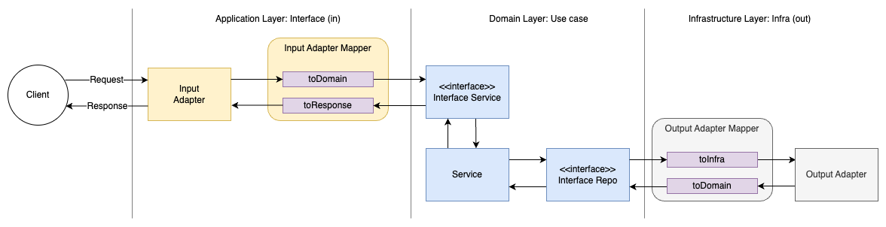

= Hexagonal Architecture
:toc:

== Introduction

When it comes to structuring and layering your application, there are many different approaches. One of the most popular is the Hexagonal Architecture, also known as Ports and Adapters. This architecture is a great way to decouple your application from the framework you are using, and to make your application more testable.

As often with design, there are many ways to implement it. This guide will propose one way, while going beyond just simple hello world.

== The Hexagonal Architecture

=== Principles

To implement hexagonal architecture, you need to follow a few principles:

* Isolate the domain from the outside concerns by using ports and adapters
* Manage dependencies from outside in, in direction to the domain
* Separate clearly the incoming interfaces (APIs), the domain, and the infrastructure (outgoing)

=== Typical Flow

Before looking at the package structure, let's first look at the typical flow of a request in a Hexagonal Architecture:

=== Package Structure

Similar to Clean Architecture, the Hexagonal Architecture is composed of three layers. Although in literature the names of the layers may vary (often named application, domain and infrastructure), the concepts remain the same.

These are the layers being used in this hands-on project:
|===
| Layer | Description

| application
| This layer contains the application logic, including the use cases and services that encapsulate the core business logic of the app.

| domain
| This layer contains the domain model and repositories that interact with the core business entities. Depending on your style, the domain model itself may contain the application logic.

| adapters
| This layer contains the adapters that connect the application to external systems and frameworks.
|===

Below is a more detailed, exemplary view of the package structure:

[source,bash]
----
com.example.userservice
|-- application
|   |-- usecases
|   |   |-- CreateUserUseCase.java
|   |   |-- GetUserUseCase.java
|   |   |-- UpdateUserUseCase.java
|   |-- services
|       |-- UserService.java
|
|-- domain
|   |-- model
|   |   |-- User.java
|   |-- repository
|       |-- UserRepository.java
|
|-- adapters
|   |-- inbound
|   |   |-- rest
|   |   |   |-- UserController.java
|   |-- outbound
|       |-- database
|       |   |-- JpaUserRepository.java
|       |-- messaging
|           |-- MessagePublisher.java
|           |-- KafkaMessagePublisher.java
|
|-- config
|   |-- AppConfig.java
|
|-- MicroserviceApplication.java
----