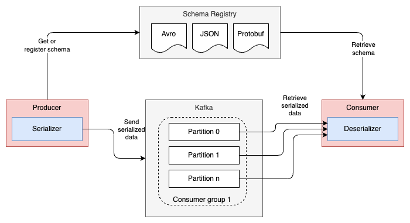

= Producer consumer messaging with Kafka and Avro
:toc:

== Introduction

=== What's this?

Even with applications just doing simple messaging (coordination), using a schema registry to share message schemas between producers and consumers is a good idea. This is beneficial when the messages are serialized using Avro, Protobuf or JSON schema, as the same in the messaging world forms the API and therefore should have a contract as well (as with ordinary JSON/XML APIs).

This guide provides a high-level overview and some starting points for using Kafka with Avro and the Apicurio schema registry for simple messaging between a producer and consumer.

== Producer consumer messaging flow

=== Overview

=== Messaging flow

Let's start with the messaging flow. The producer generates a message using the schema, serializes it into byte array and then sends it to the Kafka broker. The broker stores the serialized message as record into the designated topic. Then the consumer subscribed to the topic deserializes the message using the schema and then processes it.

Using link:https://developer.confluent.io/courses/schema-registry/key-concepts/[key concepts of schema registry], both the producer and consumer share the same schema version, where usually through the usage of language agnostic client libraries the entire serialization and deserialization process can be handled automatically (download correct schema version, generate sources, validation, etc.).

=== Avro Schema management with Maven

There are two Maven plugins used to interact with the schema:

* avro-maven-plugin - used to generate Java sources from the Avro schema
* apicurio-registry-maven-plugin - used to register the Avro schema into registry, or download the schema from registry

Depending on if it is the producer or consumer, the configuration looks slightly different - in this example the producer is defining and uploading the schema, which depending on the messaging pattern being used can also be the opposite. For more details see:

* link:../services/orders/pom.xml[Producer pom.xml]
* link:../services/payments/pom.xml[Consumer pom.xml]

=== Kafka topic configuration

The selected Kafka setup in this example is kept as simple as possible by intention. For the topic it means to have only a single consumer group and a couple of partitions being assigned to the same consumer. Concerning consumer groups and the various combinations, see this blog post for more details: link:https://codingharbour.com/apache-kafka/what-is-a-consumer-group-in-kafka/[What is a Consumer Group in Kafka?].

So although a message is being delivered only to one consumer, in our setup it will obviously be the same consumer getting messages from any partition.

To provision the topic, in this example a programmatic way is used. See the link:../services/orders/src/main/kotlin/io/dietschi/edu/spring_kafka_handson/orders/config/KafkaConfig.kt[KafkaConfig.kt] for details.

=== Kafka infra setup

For local exploration, the Kafka setup including some useful tools has been kept as simple as possible as well. Notably the Kakfa version is still using Zookeeper and a single node setup with Docker compose and Strimzi. For more details see the link:../etc/docker-compose/local-dev-infra.yml[docker-compose.yml] file.

=== Integration with Spring Boot

When in comes to integration with Spring Boot, there are multiple options available. To keep things simple in this example `Spring Kafka` has been used as the client library. For more details, see the following resources:

* link:../services/orders/src/main/kotlin/io/dietschi/edu/spring_kafka_handson/orders/adapters/outbound/messaging/KafkaOrderProducer.kt[KafkaOrderProducer.kt]
* link:../services/payments/src/main/kotlin/io/dietschi/edu/spring_kafka_handson/payments/adapters/inbound/messaging/KafkaOrderListener.kt[KafkaOrderListener.kt]
* link:../services/orders/src/main/kotlin/io/dietschi/edu/spring_kafka_handson/orders/adapters/outbound/messaging/KafkaOrderRepository.kt[KafkaOrderRepository.kt]